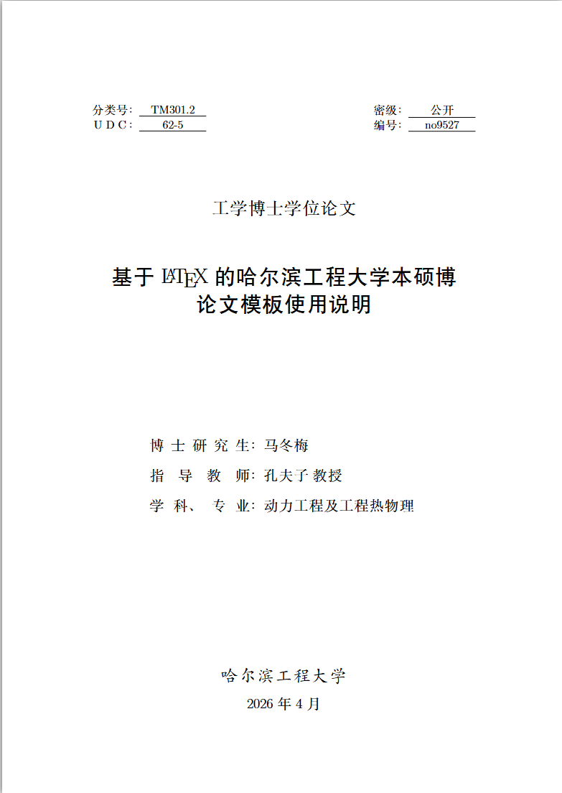
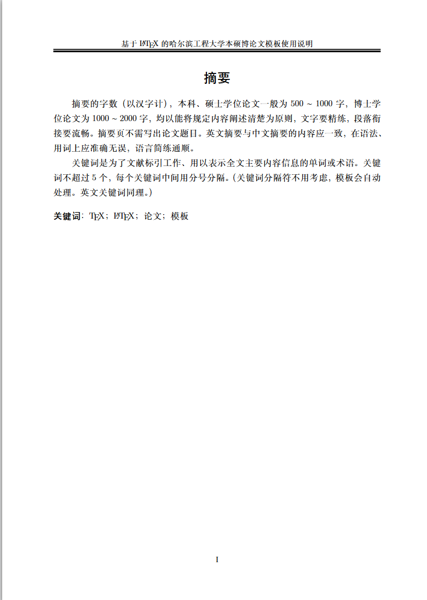
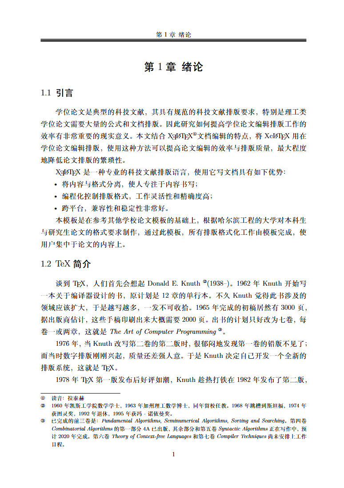
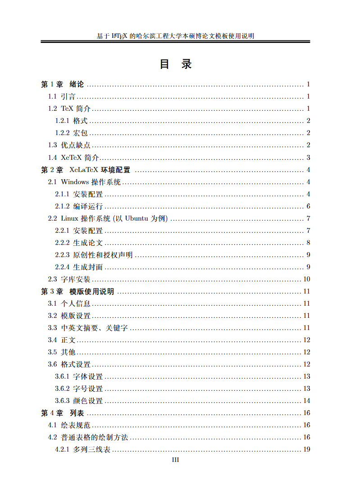
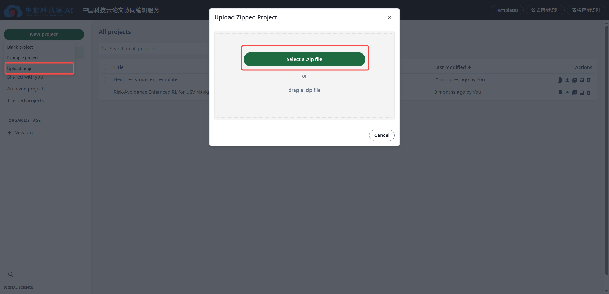
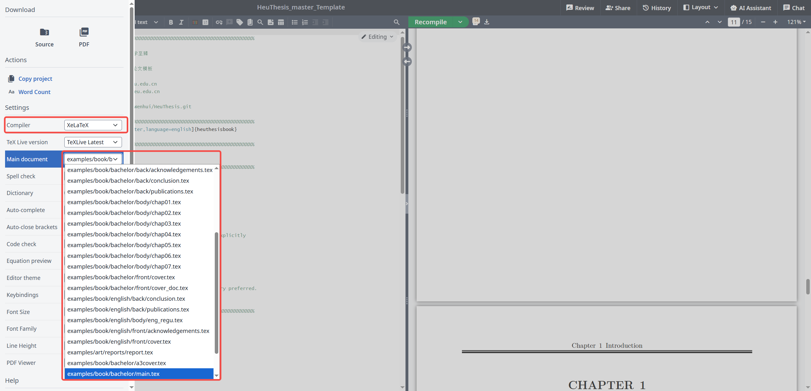
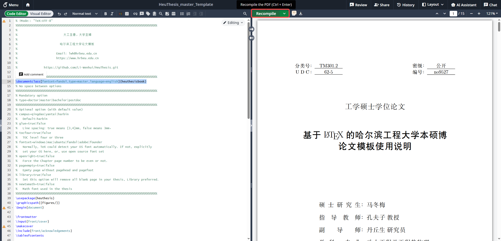
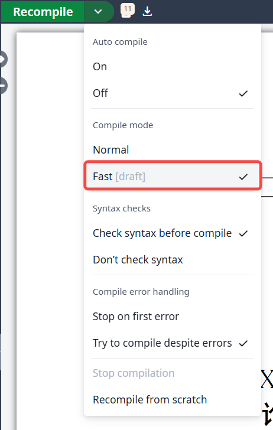

# HEUThesis Overleaf Edition

> 哈尔滨工程大学论文模板（Overleaf 定制版）  
> 开箱即用、上传即编译、覆盖本科/硕博/英文/开题中期等常见场景。


## PDF 效果预览

<p>
  
  
  
  
</p>

## 项目简介

本项目基于 [Li-Wenhui/HeuThesis](https://github.com/Li-Wenhui/HeuThesis) 二次整理，针对 Overleaf 场景完成适配，内置 `.cls`、`.cfg`、`.ist` 等关键文件，减少本地安装和环境配置成本。

如果你想要的是：

- 不折腾本地 TeXLive，直接在线写论文
- 用同一套模板覆盖不同培养层次与阶段
- 快速切换本科/硕士/博士/英文版入口

这个仓库就是为此准备的。

## 平台建议

- [Overleaf 官方平台](https://cn.overleaf.com/)：（但是最近逐渐抠门，20s的免费编译时间已经不足以编译本模板）一人血书学校开通Overleaf会员
- **[中科院中国科技云免费平台](https://www1.cstcloud.cn/resources/452)（推荐）**：中科院部署的Overleaf，供国内高校免费使用, 安全可靠
- [自行部署Overleaf社区版本](https://github.com/overleaf/toolkit)：适合技术大手子在本地部署，编译本项目需要安装完整的字库，推荐使用 Docker 版本部署

## 支持范围

| 类型                 | 支持状态 | 入口示例                                        |
| -------------------- | -------- | ----------------------------------------------- |
| 本科毕业论文         | ✅       | `examples/book/bachelor/main.tex`               |
| 硕士/博士学位论文    | ✅       | `examples/book/bachelor/main.tex` 中修改 `type` |
| 英文论文             | ✅       | `examples/book/english/main.tex`                |
| 开题/中期报告（art） | ✅       | `examples/art/reports/report.tex`               |
| 博后出站相关格式     | ✅       | 通过 `type=postdoc` 选项切换                    |

## 5 分钟快速开始

1. 将仓库打包上传到 Overleaf 项目。
2. 设置编译器为 `XeLaTeX`。
3. 设置主文件为你需要的入口文件（见下方“入口文件速查”）。
4. 点击 `Recompile` 编译；若想提速，可开启 `Fast` 模式。






## 入口文件速查

| 场景              | 推荐入口文件                      | 说明                                                                |
| ----------------- | --------------------------------- | ------------------------------------------------------------------- |
| 本科/硕博中文论文 | `examples/book/bachelor/main.tex` | 通过 `\documentclass` 的 `type=doctor/master/bachelor/postdoc` 切换 |
| 英文论文          | `examples/book/english/main.tex`  | `language=english`                                                  |
| 开题/中期报告     | `examples/art/reports/report.tex` | `stage=opening/midterm`                                             |

## 常用参数速查

`heuthesisbook`（学位论文）常用选项：

- `type=doctor|master|bachelor|postdoc`
- `fontset=windows|mac|ubuntu|fandol|adobe|founder`
- `tocfour=true|false`
- `openright=true|false`
- `pageempty=true|false`
- `language=english`（英文论文）

`heuthesisart`（开题/中期）常用选项：

- `type=doctor|master|bachelor`
- `stage=opening|midterm`
- `toc=true|false`

字体建议：

- Linux 优先使用 [Fandol](https://www.ctan.org/pkg/fandol)：`fontset=fandol`

## 项目结构

```text
.
├─ examples/
│  ├─ book/
│  │  ├─ bachelor/    # 中文论文示例（可切换本硕博/博后）
│  │  └─ english/     # 英文论文示例
│  └─ art/reports/    # 开题/中期报告示例
├─ images/            # README 截图资源
└─ heuthesis*.cls/.cfg/.sty/.bst
```

## 致谢与说明

- 本模板演进过程中参考了哈工大论文模板 HiThesis 的设计思路。
- 学校规范、范例和实际审查口径可能存在差异，本仓库提供的是规范化参考实现。
- 因使用本模板导致的格式审查结果，请以学院/学校最终要求为准。
